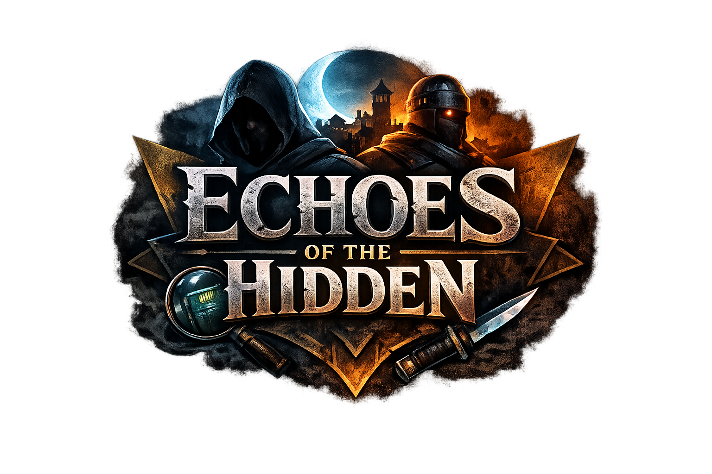

<div align="center">



<br/>

### **AI-Powered Top-Down Stealth Experience**


**Echoes of the Hidden** is a browser-based stealth game set inside a top-secret military compound.
You are a covert operative dropped behind enemy lines — gather intelligence, talk your way through danger, complete missions, and escape alive.

Every NPC is driven by a **large language model** (Gemini 2.0 Flash). They have memories, motives, and personalities. Conversations change based on your choices, and guards adapt to your behavior in real time.

[🎮 Play Now](#-getting-started) · [🕵️ Features](#️-core-features) · [🗺️ The Compound](#️-the-compound) · [🎭 NPCs](#-meet-the-npcs) · [🛠️ Tech Stack](#️-tech-stack)

---
</div>

## 🕵️ Core Features

| Feature | Description |
|:---|:---|
| 🔦 **Stealth System** | 8 guards patrol the compound with **cone-based vision detection**. Stay out of their line-of-sight. If spotted, they **chase** you. |
| 🤖 **AI-Powered NPCs** | 6 unique NPCs with distinct personalities, backstories, and dialogue — all powered by **Google Gemini 2.0 Flash**. |
| 📈 **Suspicion Meter** | Getting spotted raises your suspicion level from **HIDDEN → ALERT → DANGER**. At max suspicion, your reputation drops. |
| ⭐ **Reputation System** | Your actions influence how NPCs react. Friendly interactions boost reputation; getting caught by guards destroys it. |
| 📋 **Dynamic Missions** | NPCs assign missions based on conversation context — steal documents, disable cameras, smuggle packages, and more. |
| 💾 **Persistent State** | Game state (position, reputation, suspicion, missions) saves to **LocalStorage** and survives browser reloads. |
| 📊 **Analytics** | Optional **Firebase Analytics** tracks gameplay events — NPC interactions, mission starts/completions, suspicion maxouts. |
| 🔐 **Secure Architecture** | API key stays server-side. Express backend proxies Gemini requests with rate limiting, input sanitization, and Helmet security. |

---

## 🗺️ The Compound

The game takes place in a **60×45 tile** military compound (2400×1800 px). Rooms are connected by corridors, and the only exit is at the **north gate**.

```
┌──────────────────────────────────────────────────────────────┐
│                         ▓▓▓▓ EXIT ▓▓▓▓                      │
│                                                              │
│  ┌──────────┐   ┌────────┐   ┌────────┐   ┌──────────────┐  │
│  │ SECURITY │   │CORRIDOR│   │CORRIDOR│   │  SERVER ROOM  │  │
│  │  OFFICE  │   │ ROOM 1 │   │ ROOM 2 │   │ ⚠ RESTRICTED │  │
│  └────⊞────┘   └───⊞────┘   └───⊞────┘   └──────⊞───────┘  │
│        │             │            │               │          │
│ ═══════╪═════════════╪════════════╪═══════════════╪════════  │
│        │         MAIN CORRIDOR                    │          │
│  ┌─────┴────┐                              ┌─────┴──────┐   │
│  │          │     ◆  ◆  ◆                  │   ARMORY   │   │
│  │ BARRACKS │     ◆  ◆  ◆  COURTYARD      │            │   │
│  │          │     ◆  ◆  ◆  (with pillars)  └────────────┘   │
│  └──────────┘                                                │
│                                                              │
│ ═══════════════════════════════════════════════════════════   │
│  ┌────────────┐   ┌──────────┐    ┌──────────────────────┐   │
│  │  MESS HALL │   │ STORAGE  │    │   COMMAND CENTER     │   │
│  │            │   │          │    │   ⚠ RESTRICTED      │   │
│  └────────────┘   └──────────┘    └──────────────────────┘   │
└──────────────────────────────────────────────────────────────┘

◆ = Pillars (cover)    ⊞ = Door    ⚠ = Restricted Zone
```

### Room Guide

| Room | Location | Intel |
|:---|:---|:---|
| **Security Office** | Top-left | Controls the surveillance grid. Disable cameras from here. |
| **Server Room** ⚠ | Top-right | Restricted. Houses classified data and biological samples. |
| **Barracks** | Mid-left | Guard quarters. Dr. Voss is stationed nearby. |
| **Courtyard** | Center | Open area with 9 pillars for cover. Heavily patrolled. |
| **Armory** | Mid-right | Weapon storage. Captain Ironjaw and Viper lurk here. |
| **Mess Hall** | Bottom-left | Kitchen Worker's domain. Good for distraction opportunities. |
| **Storage** | Bottom-center | Arms Dealer's supply stash. Smuggling hub. |
| **Command Center** ⚠ | Bottom-right | Restricted. Commander's HQ. Holds corruption evidence. |
| **North Exit** | Top-center | The only way out. Electronically locked. |

---

## 🎭 Meet the NPCs

Each NPC has a unique personality, backstory, and missions. When the backend AI is active, conversations are fully dynamic — they react to what you say, remember previous exchanges, and assign missions contextually.

<table>
<tr>
<td width="50%">

### 🕵️ Shadow Broker — *Informant*
> *"You don't look like one of them."*

Paranoid ex-intel analyst. Trades secrets from the shadows. Speaks in riddles and trusts no one — but respects bold agents.

**Missions:**
- 📄 **Stolen Intelligence** — Recover the classified dossier from the Server Room
- 🎧 **Wiretap the Captain** — Plant a listening device near the Guard Captain

</td>
<td width="50%">

### 👨‍🍳 Kitchen Worker — *Civilian*
> *"The guards talk when they think no one's listening..."*

Nervous mess hall worker who overhears guard rotations. Her brother was taken to the Command Center — she'll tell you everything she knows if you help find him.

**Missions:**
- 🔥 **Create a Distraction** — Set off the fire alarm in the Mess Hall
- 🔍 **Find My Brother** — Search the Command Center for any sign of him

</td>
</tr>
<tr>
<td>

### 💻 Ghost — *Hacker*
> *"I make security systems cry for mercy."*

Sarcastic tech genius implanted inside the compound. Can disable cameras and crack locks — but needs someone with legs and guts to get physical access.

**Missions:**
- 📡 **Disable Surveillance** — Plug a USB drive into the Security Office terminal
- 💾 **Data Extraction** — Download encrypted files from the Server Room

</td>
<td>

### ⚔️ Ironjaw — *Guard Captain*
> *"You move like someone with a purpose."*

15-year veteran who suspects the Commander is corrupt. Will fight you if provoked, but bring him evidence of corruption and he'll turn the guards against the Commander.

**Missions:**
- 📜 **Evidence of Corruption** — Bring proof from the Command Center
- 🗣️ **Convince the Ranks** — Show evidence to 3 guards

</td>
</tr>
<tr>
<td>

### 🩺 Dr. Voss — *Doctor*
> *"The things they ask me to do go far beyond medicine..."*

Quiet, morally conflicted medic forced into unethical experiments. Desperately wants to expose the truth but fears retaliation.

**Missions:**
- 🧪 **Destroy the Samples** — Destroy biological samples in the Server Room
- 📋 **Medical Records** — Steal experiment logs from the Command Center

</td>
<td>

### 🐍 Viper — *Arms Dealer*
> *"Everything has a price."*

Charming black market dealer who smuggles weapons through the Armory. Will sell anything — for the right price. Always angling for profit.

**Missions:**
- 📦 **Smuggle the Package** — Retrieve a package from Storage
- 💣 **Sabotage the Armory** — Tamper with weapon crates

</td>
</tr>
</table>

---

## 🎮 Controls

| Action | Key(s) |
|:---|:---:|
| **Move** | `W` `A` `S` `D` / Arrow Keys |
| **Interact with NPC** | `E` (when nearby) |
| **Close Dialogue** | `Esc` |
| **Save Game** | HUD button (top-right) |
| **Load Game** | HUD button (top-right) |
| **Reset Game** | HUD button (top-right) |

---

## 🛠️ Tech Stack

```
┌─────────────────────────────────────────────────┐
│                   FRONTEND                       │
│  React 19 + Vite 7 + PixiJS 8 (@pixi/react)    │
│  State: Zustand  ·  UI: Framer Motion           │
│  Analytics: Firebase  ·  Icons: Lucide          │
├─────────────────────────────────────────────────┤
│                   BACKEND                        │
│  Express 4  ·  Helmet  ·  CORS  ·  Rate Limit  │
│  AI: @google/generative-ai (Gemini 2.0 Flash)  │
│  Environment: dotenv                             │
├─────────────────────────────────────────────────┤
│               INFRASTRUCTURE                     │
│  Docker  ·  Google Cloud Run  ·  Firebase       │
│  LocalStorage (game persistence)                │
└─────────────────────────────────────────────────┘
```

### Architecture

```
Browser (React + PixiJS)
   │
   │ POST /api/chat
   ▼
Express Server (port 3001)
   │
   │ Gemini SDK
   ▼
Google Gemini 2.0 Flash API
   │
   │ JSON response
   ▼
NPC dialogue + missions + reputation changes
```

---

## 🚀 Getting Started

### Prerequisites

- **Node.js** v18+
- **npm**
- **Gemini API Key** — [Get one here](https://aistudio.google.com/app/apikey) (free)

### Installation

```bash
# Clone the repository
git clone https://github.com/Priyanshu-Iron/Echoes-of-the-Hidden.git
cd Echoes-of-the-Hidden

# Install frontend dependencies
npm install

# Install backend dependencies
cd server && npm install && cd ..

# Configure environment
cp .env.example .env
# Edit .env and add your GEMINI_API_KEY
```

### Run the Game

You need **two terminals** — one for the frontend, one for the backend:

```bash
# Terminal 1: Start the backend (AI server)
cd server && npm run dev

# Terminal 2: Start the frontend (game)
npm run dev
```

Open **http://localhost:5173** in your browser and begin your mission.

> **💡 Tip:** The game works without the backend server too — NPC dialogues will fall back to rich pre-written responses. But for the full AI experience, start both servers.

---

## 🔧 Environment Variables

| Variable | Required | Description |
|:---|:---:|:---|
| `GEMINI_API_KEY` | ✅ | Google Gemini API key for AI-powered NPC dialogue |
| `VITE_FIREBASE_API_KEY` | ❌ | Firebase Analytics API key |
| `VITE_FIREBASE_AUTH_DOMAIN` | ❌ | Firebase auth domain |
| `VITE_FIREBASE_PROJECT_ID` | ❌ | Firebase project ID |
| `VITE_FIREBASE_STORAGE_BUCKET` | ❌ | Firebase storage bucket |
| `VITE_FIREBASE_MESSAGING_SENDER_ID` | ❌ | Firebase messaging sender ID |
| `VITE_FIREBASE_APP_ID` | ❌ | Firebase app ID |
| `VITE_FIREBASE_MEASUREMENT_ID` | ❌ | Firebase measurement ID |

---

## 🧪 Testing

The project includes comprehensive unit tests using **Vitest**:

```bash
# Run all tests
npm test

# Watch mode
npm run test:watch

# Coverage report
npm run test:coverage
```

**Test coverage includes:**
- ✅ Player movement & wall collision
- ✅ Reputation system (clamping, increase, decrease)
- ✅ Suspicion system (set, clamp, analytics logging)
- ✅ Dialogue state management
- ✅ Mission lifecycle (activate, complete)
- ✅ Geometry utils (distance, angle, cone detection)
- ✅ Map data integrity
- ✅ AI service (rate limiting, sanitization, mock fallback)
- ✅ Save/load system (LocalStorage)

---

## 🚢 Deployment

The game can be deployed to **Google Cloud Run** (recommended) or **Firebase Hosting**. See the full deployment guide:

📖 **[DEPLOY.md](DEPLOY.md)** — Step-by-step instructions for both methods.

### Quick Deploy (Cloud Run)

```bash
gcloud run deploy echoes-game \
  --source . \
  --port 80 \
  --allow-unauthenticated \
  --region us-central1 \
  --set-env-vars GEMINI_API_KEY=your_key_here
```

---

## 📁 Project Structure

```
Echoes-of-the-Hidden/
├── src/
│   ├── assets/              # Logo and static assets
│   ├── components/
│   │   ├── GameCanvas.jsx   # Main game renderer (PixiJS)
│   │   └── UI/
│   │       ├── HUD.jsx      # Suspicion, reputation, missions
│   │       ├── DialogueBox.jsx  # NPC chat interface
│   │       └── GameAnnouncer.jsx
│   ├── game/
│   │   ├── Player.jsx       # Player character & movement
│   │   ├── Guard.jsx        # Guard AI (patrol, chase, vision cone)
│   │   ├── NPC.jsx          # NPC rendering & proximity detection
│   │   ├── TileMap.jsx      # Map renderer
│   │   ├── mapData.js       # Compound layout, spawns, rooms
│   │   └── constants.js     # Game-wide constants
│   ├── services/
│   │   ├── ai.js            # AI chat service (Gemini + mock fallback)
│   │   ├── storage.js       # Save/load (LocalStorage)
│   │   └── firebase.js      # Analytics events
│   ├── state/
│   │   └── store.js         # Zustand global state
│   └── utils/
│       ├── geometry.js      # Distance, angle, cone detection
│       ├── useInput.js      # Keyboard input hook
│       ├── styles.js        # Shared UI style tokens
│       └── pixi.js          # PixiJS utilities
├── server/
│   ├── index.js             # Express API server (Gemini proxy)
│   └── middleware/
│       ├── rateLimit.js     # Rate limiting
│       └── sanitize.js      # Input sanitization
├── Dockerfile               # Production container
├── DEPLOY.md                # Deployment guide
└── package.json
```

---

## 🎯 Game Tips

> 💡 **Watch the vision cones.** Guards have a 60° field of view and 200px range. Stay behind them or wait for gaps in their patrol route.

> 💡 **Talk to everyone.** NPCs give you critical intel about guard schedules, room layouts, and escape routes. Say "hello" first to build rapport before asking for missions.

> 💡 **Use the corridors.** The main corridors are your safest paths. Restricted zones (Server Room, Command Center) are high-risk, high-reward.

> 💡 **Save often.** Use the HUD save button before entering restricted areas. If things go wrong, you can reload.

> 💡 **Keep suspicion low.** If suspicion hits 100%, your reputation takes a heavy hit, and guards enter chase mode. Stay hidden.

---

## 📜 License

Distributed under the **MIT License**. See `LICENSE` for more information.

---

<div align="center">
  
  <br/><br/>
  <sub>Built with ❤️ by <a href="https://github.com/Priyanshu-Iron">Priyanshu-Iron</a></sub>
  <br/>
  <sub>Powered by Google Gemini · React · PixiJS</sub>
</div>
